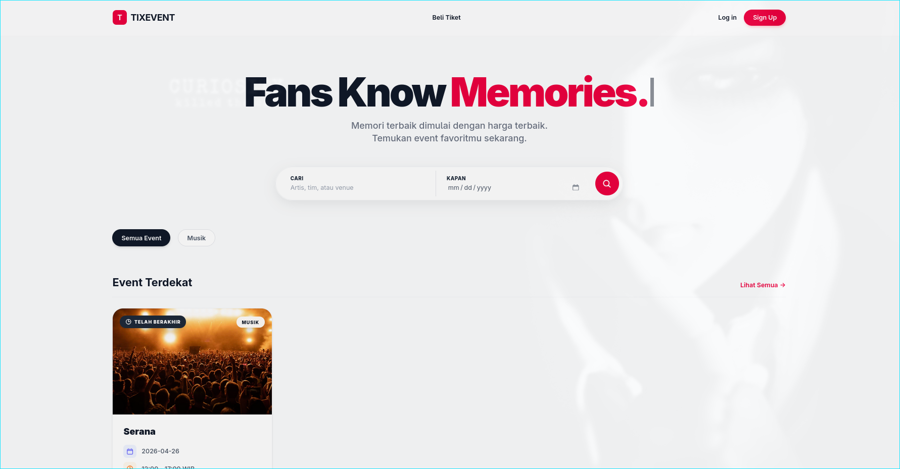
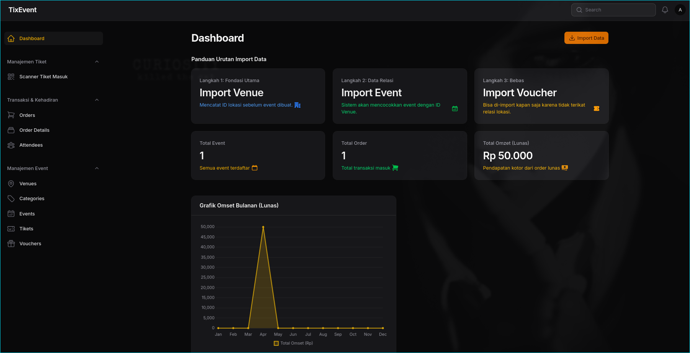

<div align="center">
  

  <h1>TIXEVENT 2026</h1>
  <p><strong>Platform E-Ticketing Modern dengan Arsitektur VILT Stack</strong></p>

  <!-- Badges -->
  <p>
    
    
    
    
    
    
    
    
  </p>
</div>

---

TIXEVENT adalah website platform e-ticketing modern yang dirancang untuk manajemen dan penjualan tiket event. Project ini dibangun khusus untuk memenuhi standar **Ujian Kompetensi Keahlian (UKK) 2026**.

Sistem ini memfasilitasi dua sisi pengguna:
- **Frontend (Pembeli):** Katalog event dinamis, pembelian tiket, klaim voucher diskon, dan e-ticket digital (PDF & QR Code).
- **Backend (Panitia):** Dashboard analitik Filament yang responsif, manajemen event, verifikasi manual, scanner QR code langsung dari sistem, dan ekspor laporan.
## Fitur Utama

**Frontend (Portal Pembeli)**
- Katalog event interaktif dengan filter kategori dan pencarian.
- Sistem *checkout* tiket dengan pembatasan kuota dan batas waktu pembayaran otomatis (Redis Queue).
- Klaim dan validasi kode voucher diskon.
- *E-Ticket* digital dilengkapi QR Code unik.
- Unduh tiket dalam format PDF.

**Backend (Filament Admin Panel)**
- Dashboard analitik interaktif (statistik penjualan, pendapatan, tren).
- Manajemen CRUD Event, Kategori, Tiket, dan Voucher.
- Verifikasi pembayaran manual.
- **QR Code Scanner** terintegrasi di sistem untuk *check-in* peserta di lokasi event.
- *Export* data transaksi dan peserta ke format CSV/Excel.
---

## Cuplikan Layar (Screenshots)

<div align="center">
  
  <p><em>Halaman Utama (Frontend)</em></p>

  
  <p><em>Halaman Admin Dashboard (Filament)</em></p>
</div>

---

## Arsitektur & Teknologi

Project ini menggunakan arsitektur **VILT Stack** modern dengan performa tinggi dan berbagai integrasi pihak ketiga:

### Core Stack
- **Frontend:** Vue.js 3.5.33 (Composition API), Inertia.js 2.3.21, Vite 6.0.6, Tailwind CSS 4.2.4.
- **Backend:** Laravel 13.6.0, PHP 8.5.5, Livewire 4.2.4.
- **Authentication:** Laravel Breeze (Inertia Vue Scaffolding).
- **Admin Panel:** Filament v5.6.1.
- **Database & Cache:** MySQL, Redis.

### Library Utama
- `barryvdh/laravel-dompdf` (Pembuatan e-ticket berformat PDF)
- `simplesoftwareio/simple-qrcode` (Pembuatan QR Code unik per tiket)
- Filament Exporter (Ekstrak laporan CSV & XLSX)
- **Environment:** Laravel Sail (Docker).

---

## Panduan Instalasi (Setup Guide)

<p align="center">
  <b><i>Proyek ini dikembangkan di Arch Linux dengan Fish Shell untuk performa maksimal.</i></b>
</p>


Aplikasi ini menggunakan Docker (Laravel Sail) untuk standarisasi lingkungan kerja. Anda tidak perlu menginstal PHP, MySQL, atau Redis secara native di komputer Anda.

### Prasyarat Sistem
- **Pengguna Windows:** Sangat disarankan menggunakan **WSL2** (Windows Subsystem for Linux) dan Docker Desktop dengan integrasi WSL2 yang aktif. Semua perintah CLI di bawah ini harus dijalankan di terminal Linux (Ubuntu) melalui WSL.
- **Pengguna Linux / macOS:** Pastikan Docker Engine dan Docker Compose telah terinstal dan berjalan.

### Langkah-langkah Setup

**1. Clone Repositori**
```bash
git clone https://github.com/Suzuya4w/tixevent.git
cd tixevent
```

**2. Instalasi Dependensi PHP**
Instal seluruh package backend menggunakan image composer bawaan Docker:
```bash
docker run --rm \
    -u "$(id -u):$(id -g)" \
    -v "$(pwd):/var/www/html" \
    -w /var/www/html \
    laravelsail/php83-composer:latest \
    composer install --ignore-platform-reqs
```

**3. Konfigurasi Environment**
Gandakan file environment:
```bash
cp .env.example .env
```
*(Catatan: Konfigurasi `.env.example` sudah disesuaikan secara bawaan untuk Laravel Sail).*
```bash
CACHE_STORE=redis
SESSION_DRIVER=redis
QUEUE_CONNECTION=redis
```
*(Ubah cache, session, dan queue di .env ke Redis agar dapat menggunakan fitur Redis Queue dan Redis Scheduler)*

**4. Jalankan Kontainer Docker**
Nyalakan seluruh server (PHP, Nginx, MySQL, Redis) di latar belakang:
```bash
./vendor/bin/sail up -d
```
*(Saya sarankan untuk membuat alias `alias sail="bash vendor/bin/sail"` agar lebih mudah mengetik perintah).*
**5. Inisialisasi Database & Storage**
Lakukan generate key, jalankan migrasi tabel beserta *seeder* awal, dan hubungkan direktori storage:
```bash
./vendor/bin/sail artisan config:clear
./vendor/bin/sail artisan key:generate
./vendor/bin/sail artisan migrate:fresh --seed
./vendor/bin/sail artisan storage:link
```

**6. Compile Aset Frontend (Vue & Tailwind)**
```bash
./vendor/bin/sail npm install
./vendor/bin/sail npm run build
```
*(Gunakan `./vendor/bin/sail npm run dev` jika Anda ingin melakukan modifikasi secara live).*

---

## Menjalankan Background Task

Platform ini menggunakan **Redis** untuk antrean tugas asinkron (Queue) seperti pembatalan tiket otomatis jika batas waktu pembayaran habis. Anda harus menjalankan worker pada *tab terminal yang terpisah*:

**Worker untuk Eksekusi Antrean (Queue):**
```bash
./vendor/bin/sail artisan queue:work
```

**Worker untuk Penjadwalan Waktu (Scheduler):**
```bash
./vendor/bin/sail artisan schedule:work
```

---

## Akses Aplikasi

Buka melalui browser:
- **Frontend (Pembeli):** `http://localhost`
- **Admin Panel (Panitia):** `http://localhost/admin`

---

### Akun Pengujian (Default Credentials)
Aplikasi ini dilengkapi dengan data dummy untuk memudahkan pengujian. Gunakan kredensial berikut untuk login:

**Admin / Panitia (Filament Dashboard)**
- Email: `admin@tixevent.com`
- Password: `password`

**Petugas (Filament Dashboard)**
- Email: `petugas@tixevent.com`
- Password: `password`

**User / Pembeli**
- Email: `user@tixevent.com`
- Password: `password`

---

## Alur Pengujian (Testing Flow)
Untuk menguji fungsionalitas utama aplikasi, ikuti langkah berikut:
1. Login sebagai **User**, pilih event, masukkan voucher (opsional), dan selesaikan *checkout*.
2. Karena sistem pembayaran masih berupa simulasi manual, login ke **Admin Panel** atau **Petugas Panel**, lalu ke halaman **Orders** dan ubah status pesanan menjadi `Paid`.
3. Kembali ke dashboard User, buka menu "Tiket Saya", dan unduh tiket sebagai PNG atau PDF.
4. Di Admin Panel, gunakan fitur Scanner untuk men-scan QR Code pada tiket PDF tersebut atau manual via Attendee.